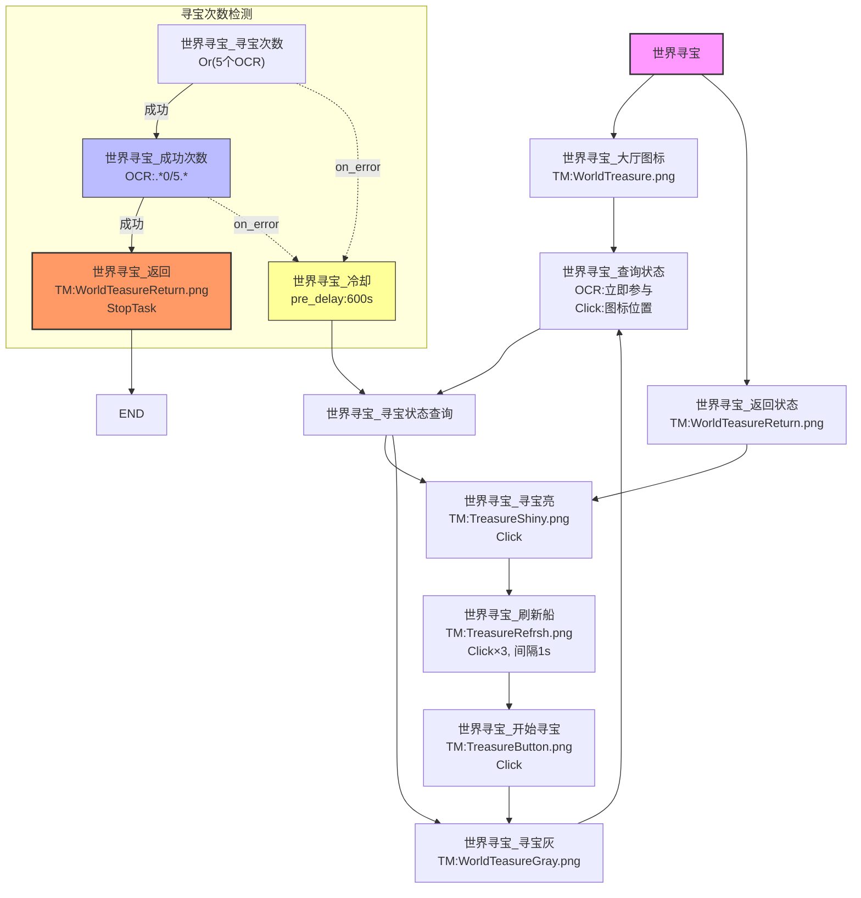
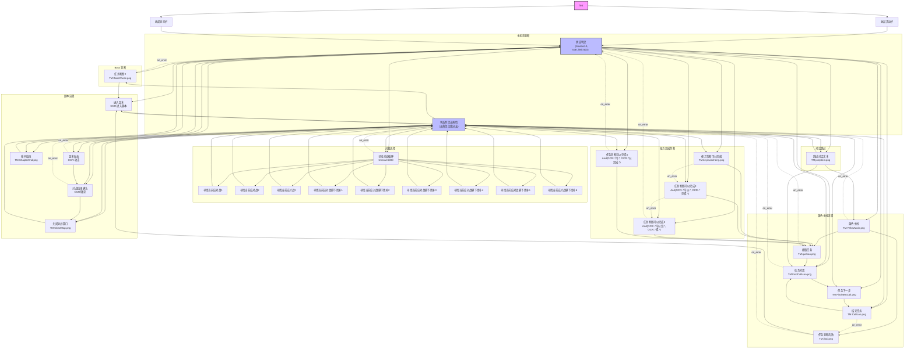

# MaaVua Pipeline 流程图

## 世界寻宝流程

## 节点说明

| 节点 | 识别方式 | 动作 | 说明 |
|------|---------|------|------|
| 收起活动栏 | TM: shouqihuodong.png | Click | 初始化收起活动栏 |
| 收起状态栏 | TM: StatusBarCollapse.png | Click | 初始化收起状态栏 |
| 跳过对话文本 | TM: jumptext.png | Click | 跳过 NPC 对话 |
| 进入副本 | OCR: "进入副本" | Click | 点击进入副本按钮 |
| 副本攻击 | OCR: "攻击" | Click | 攻击怪物 |
| 对战结束确认 | OCR: "确定" | Click | 确认战斗结算 |
| 关闭对战窗口 | TM: CloseMap.png | Click | 关闭战斗结果弹窗 |
| 章节结束 | TM: ChapterEnd.png | Click(target) | 章节通关处理 |
| 黄色主线 | TM: YellowMain.png | DoNothing | 检测黄色主线任务 |
| 接取任务 | TM: quzhao.png | Click | 接取新任务 |
| 任务对话 | TM: FindCallIcon.png | Click | 与 NPC 对话 |
| 任务下一步 | TM: FindNextCall.png | Click | 对话下一步 |
| 结束任务 | TM: CallIcon.png | Click | 完成任务对话 |
| 任务判断2 | TM: BossCheck.png | DoNothing | 检测 BOSS 战 |
| 任务判断击败 | TM: jibai.png | Click | 检测击败任务 |
| 寻找对战循环 | - | - | 寻找可攻击的怪物 |
| 寻找当前应对战1~3 | TM: searchboss{1-3}.png | Click | 模板匹配怪物位置 |
| 寻找当前应对战脚下找补1~6 | TM: OCRFootArray{1-6}.png | Click | 补位匹配怪物位置 |

> TM = TemplateMatch（模板匹配）
