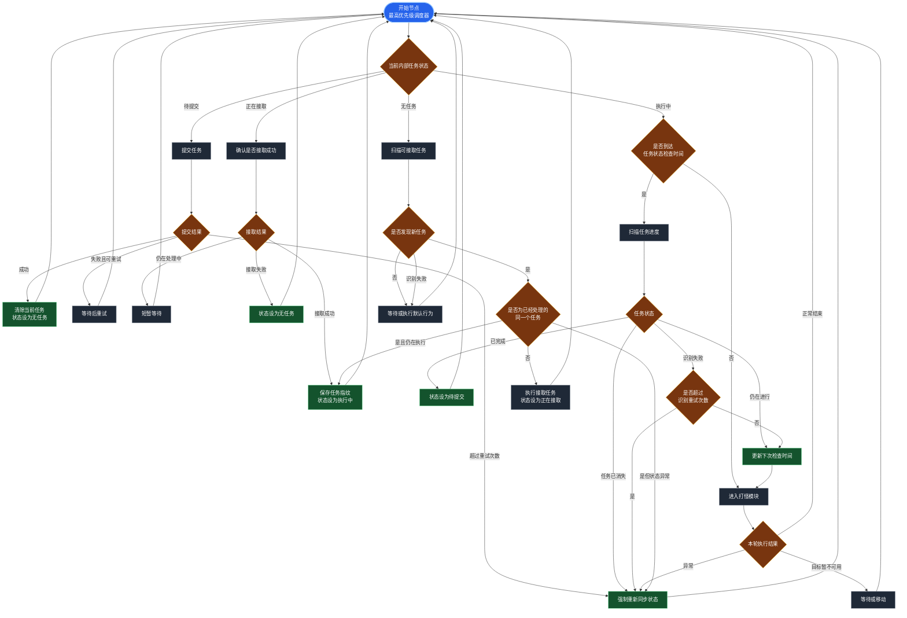

# 任务状态调度流程

开始节点是最高优先级调度器。所有操作完成后都返回开始节点，由内部任务状态决定下一步动作。

任务栏持续可见只代表可以读取任务信息，不应直接触发重复接取。接取成功后，任务状态切换为“执行中”；在到达下一次任务检查时间前，开始节点直接调度打怪模块，避免任务扫描长期占用执行流程。

## 状态定义

| 状态 | 含义 |
| --- | --- |
| 无任务 | 当前没有已接取任务，可以扫描任务列表 |
| 正在接取 | 已发出接取操作，等待确认结果 |
| 执行中 | 任务已接取，按任务目标调度打怪等执行模块 |
| 待提交 | 任务目标已经完成，优先执行提交操作 |

## 调度约束

1. 只有“无任务”状态可以扫描可接取任务。
2. “执行中”状态优先进入任务执行模块，仅按检查间隔扫描任务进度。
3. 任务扫描必须返回明确结果，不能从扫描节点直接循环回扫描节点。
4. 接取、提交和识别失败必须限制重试次数，超过限制后重新同步状态。
5. 每个动作结束后返回开始节点，不在模块之间直接跳转。
